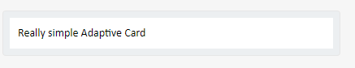

[Adaptive Cards](https://adaptivecards.io/) are a way to exchange content in a common and consistent way. Adaptive Cards can be integrated into different applications like Microsoft Teams and Outlook.

An adaptive card is presented by a JSON Schema. To get a better understanding of the schema, the [Adaptive Cards' sample site](https://adaptivecards.io/samples/) contains nearly 20 different schemas to go through. When you find an interesting schema, you can copy and paste it into the [Adaptive Cards Designer](https://adaptivecards.io/designer/). The designer allows you to edit the schema and see the changes real time.

Another good introduction to the possibilities of Adaptive Cards is [Schema Explorer](https://adaptivecards.io/explorer/).

Here's a simple JSON-schema:

```json {.line-numbers}
{
    "type": "AdaptiveCard",
    "version": "1.0",
    "body": [
        {
            "type": "TextBlock",
            "text": "Really simple Adaptive Card"
        }
    ]
}
```



### Actions

Adaptive Cards can contain actions. Actions are usually displayed as button and their functionality can range from opening links to confirming booking details. Adaptive Cards support four types of actions:

* **[OpenUrl](https://adaptivecards.io/explorer/Action.OpenUrl.html)**: An action which opens a link (href)
* **[Submit](https://adaptivecards.io/explorer/Action.Submit.html)**: Submits input fields (form)
* **[ShowCard](https://adaptivecards.io/explorer/Action.ShowCard.html)**: Cards can contain cards. ShowCard can be used to show and hide an card. Usually used for displaying more detailed data for a particular card.
* **[ToggleVisibility](https://adaptivecards.io/explorer/Action.ToggleVisibility.html)**: Action which can show or hide card elements.

Adding an action is just a matter of adding couple new lines into schema:

```json {.line-numbers}
{
	"type": "AdaptiveCard",
	"version": "1.0",
	"body": [{
		"type": "TextBlock",
		"text": "Really simple Adaptive Card"
	}],
	"actions": [{
		"type": "Action.OpenUrl",
		"title": "Open Weather Service",
		"url": "https://weather.com"
	}]
}
```


## Where to find more information?

For more information, please see the following references:

* https://docs.microsoft.com/en-us/adaptive-cards/authoring-cards/getting-started
* https://adaptivecards.io/explorer/
* https://adaptivecards.io/


