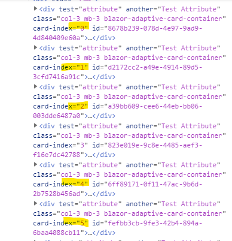

Card Collections have two parameters which can be used to add custom attributes into cards: **CardAttributes** and **CardAttributeFunctions**. 

CardAttributes is a **static** Dictionary of attributes. These attributes are applied to each card:

```html {.line-numbers}
    <CardCollection Models="@Customers" CardAttributes="@CustomAttributes"></CardCollection>
    ...

@code {
    private Dictionary<string, object> CustomAttributes = new Dictionary<string, object>() { { "test", "attribute" }, { "Another", "Test Attribute" } };
}    
```


CardAttributeFunctions allow you to define **dynamic** attributes to each card by using functions. Each function gets the model and the index of the card as parameters and they can act based on this information.

Here's an example where "card-index" attribute is applied to each card:

```html {.line-numbers}
    <CardCollection Models="@Customers" CardAttributes="@CustomAttributes" CardAttributeFunctions="@AttributeFunctions"></CardCollection>
    ...

@code {
    private Dictionary<string, object> CustomAttributes = new Dictionary<string, object>() { { "test", "attribute" }, { "Another", "Test Attribute" } };
    private List<(string, Func<int, object, object>)> AttributeFunctions = new List<(string, Func<int, object, object>)>() {
        ("card-index", (i, model) => i.ToString())
    };
}    
```

