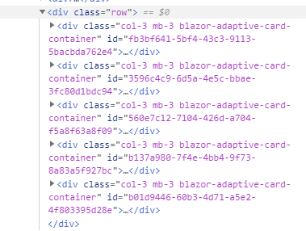
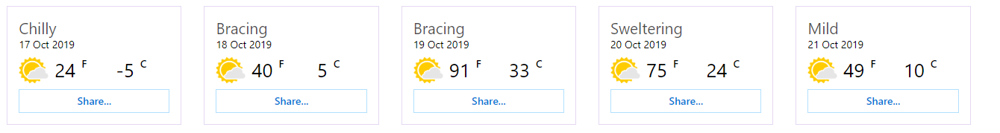
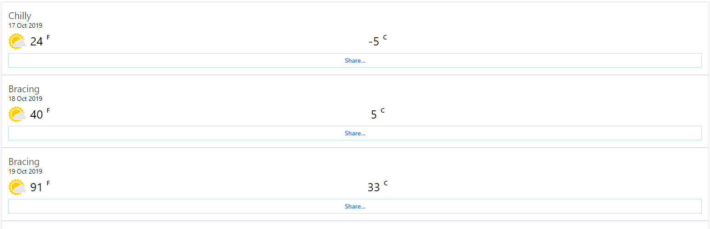

Card Collection tries not to care what CSS files you are using (Bootstrap vs Material vs custom). Couple classes are still added by default which allows the cards to render nicely when used with Bootstrap: The collection gets the class **"row"** and each of the cards is wrapped inside class **col-3**.

Card Collections contain two built-in layouts: **Div-based** layout and **List-based** layout. Div-based layout is the default one, provided by CardCollection component. It works well in situations where the applicatin uses grid systems like Bootstrap: the collection div can be given "row" as the class and each card gets "col-x" class.

List-based layout is provided by ListCardCollection. It wraps the cards into a ul and each card is inside li.

Here's the default HTML when CardCollection-component is used:



And here's the HTML with ListCardCollection:


### Customizing Layout

Card Collection components provide two main parameters which can be used to customize how cards are rendered: **Class** and **CardClass**. Class can be used to set the container's class and CardClass changed the class of each card. Here's an example code where card-columns and card classes are applied to the container and to the cards:

```html {.line-numbers}
    <CardCollection class="card-columns" CardClass="card" Models="@forecasts" Schema="@Schemas.WeatherTemplated"></CardCollection>
```

And here's the HTML:


If you are using Bootstrap, the easiest way to make cards larger and smaller are through the CardClass-parameter. To make cards smaller:

```html {.line-numbers}
    <CardCollection CardClass="col-2" Models="@forecasts" Schema="@Schemas.WeatherTemplated"></CardCollection>
```



And to make cards larger:

```html {.line-numbers}
    <CardCollection CardClass="col-12" Models="@forecasts" Schema="@Schemas.WeatherTemplated"></CardCollection>
```

