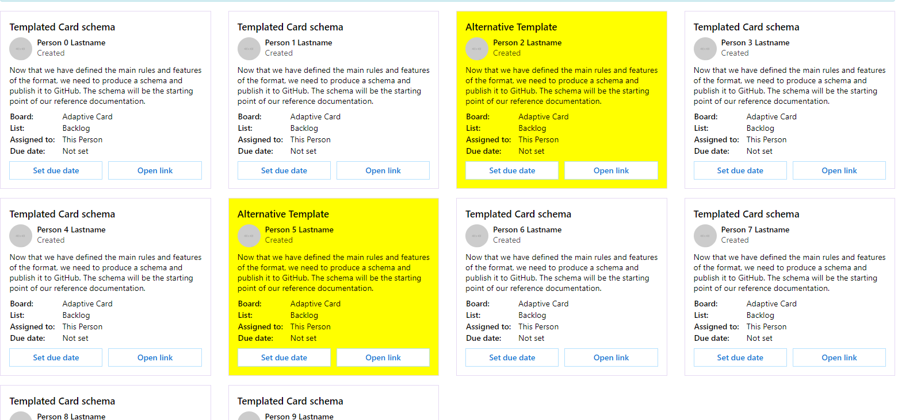

Card Collections with Template Selectors provide a powerful way to customize the cards based on the model. An example could be a list of invoices. If an invoice is past its due date, a different schema could be used. Template Selector allows you to define a function which selects the template based on some criteria.

Easiest way to use Template Selector is to add the available schemas through application's ConfigureServices:

```csharp {.line-numbers}
services.AddBlazorAdaptiveCards()
    .AddTemplate<Customer>(Schemas.CustomerTemplated)
    .AddFileTemplate("Alternative", "AlternativeTemplatedAdaptiveCard.json");
```

This way you can retrieve the templates in Template Selector using **IModelTemplateCatalog**.

Use **TemplateSelector** parameter of CardCollection to define the selection criteria. IModelTemplateCatalog is useful in these scenarios as it can be used to get a schema by its name:

```html {.line-numbers}
@if (Customers?.Any() == true)
{
    <CardCollection TemplateSelector="SelectTemplate" Models="@Customers"></CardCollection>
}

@code {
    private List<Customer> Customers = new List<Customer>();

    [Inject]
    private IModelTemplateCatalog ModelTemplateCatalog { get; set; }

    protected override void OnInitialized()
    {
        Customers.Clear();

        for (int i = 0; i < 10; i++)
        {
            Customers.Add(new Customer() { FirstName = $"Person {i}", LastName = "Lastname" });
        }
    }

    private string SelectTemplate(object customer)
    {
        var cust = (Customer)customer;
        if (cust.FirstName.Contains("2") || cust.FirstName.Contains("5"))
        {
            return ModelTemplateCatalog.Get("Alternative");
        }

        return ModelTemplateCatalog.Get(customer.GetType().Name);
    }
}
```

Here's the output:

